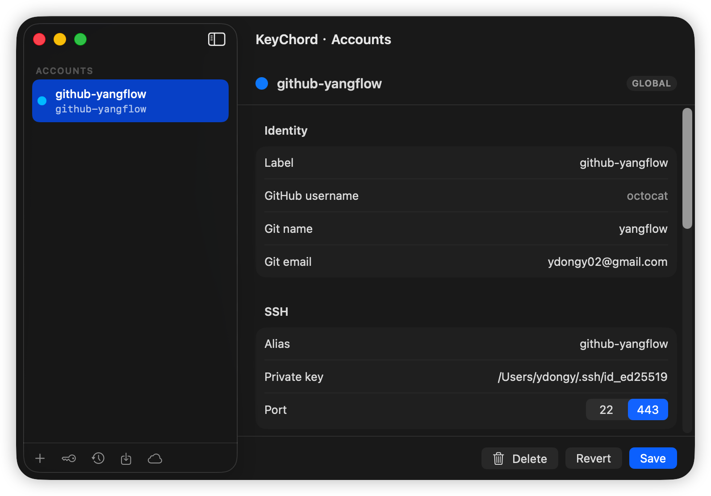
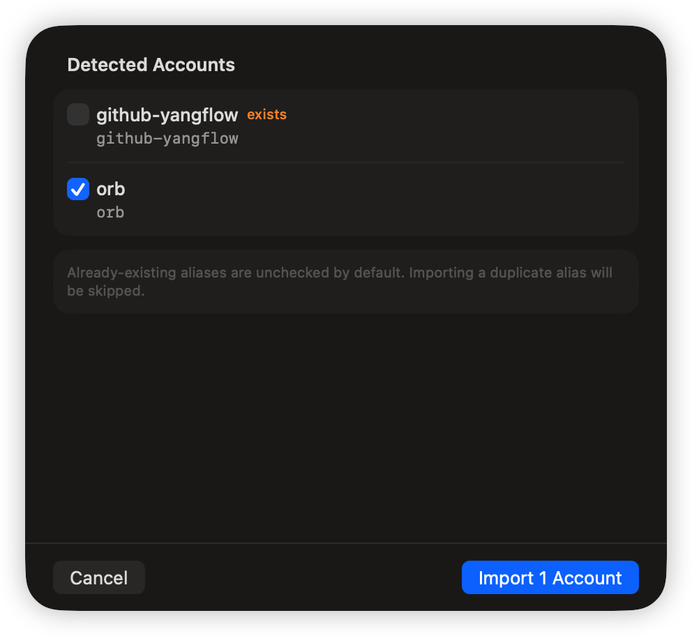
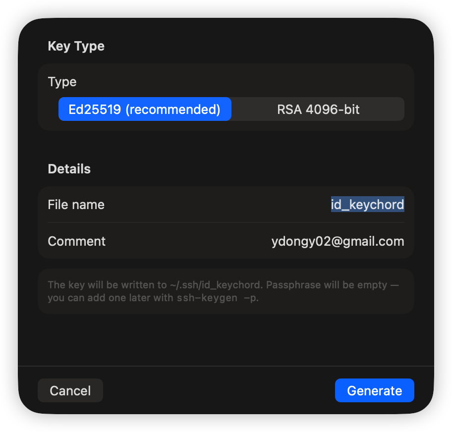

# keychord

> Manage multiple Git identities from your macOS menubar — without touching your dotfiles.

[简体中文](./README.zh-CN.md) · English

<p align="center">
  
  
</p>

keychord is a menubar-only macOS app that lets you keep several GitHub accounts on one machine — personal, work, open source — each with its own SSH key, git name/email, URL rewrites, and optional `gitdir:`-scoped activation. keychord owns a small JSON file and generates *managed* SSH config and gitconfig files; it injects a single `Include` line into your existing `~/.ssh/config` and `~/.gitconfig`. Your dotfiles stay yours.

## Why

Using more than one Git identity on the same Mac usually means either:
- hand-editing `~/.ssh/config` + `~/.gitconfig` + `~/.gitconfig-work` and hoping you remember which alias to `git clone` with, or
- sprinkling `GIT_SSH_COMMAND` everywhere.

keychord makes the identity set a first-class thing you can CRUD from a window, and projects the result back into real config files in a way that is auditable, reversible, and leaves everything else you wrote by hand untouched.

## Features

<p align="center">
  
  
</p>

- **Account CRUD** — add, edit, delete accounts from a native `NavigationSplitView` window. Source of truth: `~/.config/keychord/accounts.json`.
- **`gitdir:` scoping** — each account can be global or scoped to a working directory via git's `includeIf gitdir:` mechanism.
- **URL rewrites** — per-account `insteadOf` / `pushInsteadOf` rules land in the generated gitconfig.
- **Selective import** — detect logical accounts from your current `~/.ssh/config` + `~/.gitconfig`, then pick which ones to import via a checkbox sheet. Existing aliases are flagged and skipped automatically.
- **Doctor & Fixer** — diagnose common config problems (missing keys, wrong permissions, dangling `Include`, conflicting `IdentityFile`) and apply one-click fixes.
- **SSH port selection** — per-account Direct 22 / SSL 443 toggle. Useful on networks where port 22 is blocked.
- **SSH key generator** — create an ed25519 or RSA key from the app with safe filenames and correct permissions.
- **Atomic backups** — every write is preceded by a snapshot of `accounts.json` in `~/.config/keychord/backups/`, browsable from the Restore view.
- **iCloud Sync** — optional sync of the account list across machines via `NSUbiquitousKeyValueStore`. SSH keys stay local; only metadata travels.
- **Probes** — per-host `ssh -T git@<alias>` probes so you can see at a glance which accounts authenticate.
- **Menubar-only** — `LSUIElement = YES`. No dock icon, no window stealing focus. Drag a folder onto the menubar icon to resolve which account would push from there.

## How it works (the managed-file model)

keychord never rewrites the body of your existing config files. Instead:

1. `accounts.json` is the source of truth.
2. On every save, `AccountProjector` writes three flavors of *managed* files under `~/.config/keychord/`:
   - `ssh_config.managed` — one `Host` block per account
   - `gitconfig.managed` — global `[user]`, url rewrites, `[includeIf]` pointers for scoped accounts
   - `gitconfig-<uuid>.managed` — one per `gitdir:`-scoped account, holding `[user]` + `[core] sshCommand`
3. `IncludeInstaller` injects (once, idempotently) a marker-wrapped `Include` block at the top of your real `~/.ssh/config` and `~/.gitconfig`:
   ```
   # --- keychord managed ---
   Include ~/.config/keychord/ssh_config.managed
   # --- keychord managed end ---
   ```
4. Everything outside the marker block is left exactly as you wrote it. Uninstalling is removing the marker block.

This means keychord plays nicely with hand-written config, dotfile managers, and home-manager.

## Requirements

- macOS 26.2 or later
- Apple Silicon

## Install

### Homebrew (recommended)

```bash
brew tap yangflow/keychord
brew install --cask keychord
```

### Manual download

Grab the latest `KeyChord-<version>.dmg` from [Releases](https://github.com/yangflow/keychord/releases), open it, and drag **KeyChord.app** to `/Applications`.

If the app is not notarized, clear the quarantine flag on first launch:

```bash
xattr -cr /Applications/KeyChord.app
open /Applications/KeyChord.app
```

### Build from source

```bash
git clone https://github.com/yangflow/keychord.git
cd keychord
open keychord.xcodeproj
```

Select the `keychord` scheme and ⌘R. Or build a standalone `.app` with the build script:

```bash
./scripts/build.sh
mv dist/KeyChord.app /Applications/
```

The first launch creates `~/.config/keychord/` on demand; nothing is written to your real dotfiles until you click **Save** on an account.

### Running tests

```bash
xcodebuild test \
  -scheme keychord \
  -destination 'platform=macOS' \
  -only-testing keychordTests \
  CODE_SIGNING_ALLOWED=NO
```

The unit test suite covers the SSH config parser, the git config IO layer, `AccountProjector`, `AccountsStore`, `AccountImporter`, `Doctor`, `Fixer`, `BackupService`, and the keygen service.

## Usage

1. Click the menubar icon. The popover shows your accounts, Doctor diagnostics, and the current repo context.
2. Click the **+** row at the bottom of the accounts list to add a new account (this opens the accounts window). Or click any account row to jump to its detail.
3. In the accounts window, use the sidebar bottom bar to:
   - **+** add a new account
   - **Key** generate an SSH key
   - **Restore** browse and restore backups
   - **Import** detect accounts from existing config and selectively import
   - **iCloud** configure cloud sync
4. Fill in label, git name/email, SSH alias, key path, optional `gitdir:` scope and URL rewrites. ⌘S saves.
5. Every save regenerates the managed files and reinstalls the `Include` line if it got wiped.
6. Back in the popover, the **Doctor** section surfaces any config problems with one-click fixes.

## Project layout

```
keychord/
├── keychord/                # App sources
│   ├── Models/              # Account, ConfigModel, Diagnosis
│   ├── Services/            # AccountsStore, AccountProjector,
│   │                        # AccountImporter, IncludeInstaller,
│   │                        # ConfigStore, Doctor, Fixer, Prober,
│   │                        # BackupService, CloudSyncService,
│   │                        # KeygenService, …
│   ├── Views/               # MenuBarContent, AccountsWindowView,
│   │                        # AccountDetailView, AccountsSidebar,
│   │                        # ImportPickerView, RestoreView,
│   │                        # CloudSyncView, KeygenView, …
│   ├── AppDelegate.swift
│   └── AppState.swift
├── keychordTests/           # Swift Testing unit tests
├── keychordUITests/
├── scripts/                 # build.sh, release.sh, generate-icon
└── keychord.xcodeproj
```

## Uninstall

1. Quit KeyChord from the menubar (power icon, or ⌘Q).
2. Delete `/Applications/KeyChord.app`.
3. Remove managed config (optional):
   ```bash
   rm -rf ~/.config/keychord
   ```
4. Remove the `Include` blocks keychord injected — look for the `# --- keychord managed ---` markers in `~/.ssh/config` and `~/.gitconfig` and delete through `# --- keychord managed end ---`.

If installed via Homebrew: `brew uninstall --cask keychord`.

## Release

Maintainer workflow for cutting a release:

```bash
# 1. Build the DMG (unsigned / signed / notarized)
./scripts/release.sh 0.2.0

# 2. Create a GitHub release with the artifact
gh release create v0.2.0 \
  --title 'KeyChord 0.2.0' \
  dist/KeyChord-0.2.0.dmg

# 3. Update the Homebrew cask with the new version + SHA256
#    (SHA256 is in dist/KeyChord-0.2.0.dmg.sha256)
```

`release.sh` supports four modes via environment variables:

| Mode | Env vars | Result |
|------|----------|--------|
| **unsigned** | (none) | Ad-hoc signed DMG. Gatekeeper warns on first launch. |
| **signed** | `DEVELOPER_ID_APPLICATION` | Developer ID signed DMG. |
| **notarized** | signed + `APPLE_ID`, `APPLE_TEAM_ID`, `APPLE_APP_PASSWORD` | Notarized + stapled. Fully Gatekeeper-approved. |
| **sparkle** | notarized + `SPARKLE_PRIVATE_KEY` | Also emits Sparkle Ed25519 signature for appcast.xml. |

## Contributing

Pull requests welcome — see [CONTRIBUTING.md](./CONTRIBUTING.md) for build, test, and commit-message guidelines.

Bug reports and feature ideas go to [GitHub Issues](https://github.com/yangflow/keychord/issues).

## License

[MIT](./LICENSE) © 2026 yangflow
